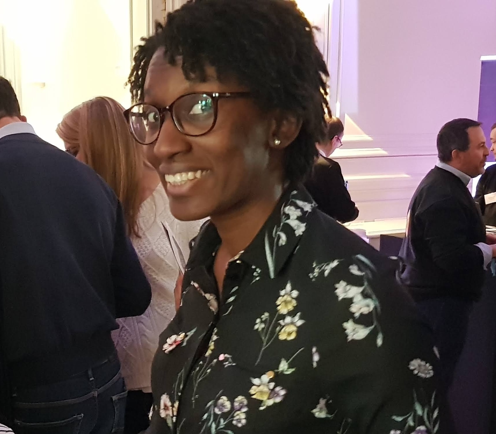

# Présentation

## A propos de moi 

Après un Master en management et 4 ans d’expérience dans divers métiers de la finance, je me reconvertis dans le developpement Web.

* Persévérante et sérieuse, je me donne toujours les moyens d’atteindre les objectifs fixés.
* Grâce à mon sens de l'organisation et ma rigueur, j'ai su tirer le meilleur de mes expériences passées.
* Je suis quelqu’un de sociable et curieux pour qui l’autre représente une source d’enrichissement à tout niveau.

## Contact

* [linkedin](https://www.linkedin.com/in/clairekodia/)
* 

# Formation

## Formation Developpeur web & mobile

**Wild Code School**, France / 03-2020 - 07-2020

* JavaScript / React / node.js
* HTML / CSS / Bootstrap
* Git & Github
* API, BDD & mySQL

## Master en Management

**EMLYON Business School Lyon**, France / 2012 - 2017

- *VBA, Valorisation d'entreprises, Financements structurés, Finance d’entreprise, Comptabilité & Prévisions financières, Négociation, Géopolitique*

## Echange académique

**University of Bradford Bradford**, Royaume-Uni / 2015

- *Financial statement analysis and valuation, International finance, Strategic financial management, European business management*

# Expérience professionnelle

## Consultant Finance & Performance

**WAVESTONE Paris**, France / 09-2019 - 11-2019

- *Cadrage d’un projet de déploiement d’un ERP à la direction financière & achat d’un grand client de la logistique*

## Analyste en Trésorerie périmètre monde

**DASSAULT SYSTEMES** Vélizy-Villacoublay, France / 2018 - 2019 

- *Gestion de l’intégration des entités nouvellement acquises du périmètre EMEA*
- *Gestion quotidienne de la trésorerie en Euro et en devises du groupe*

## VIE Contrôle de Gestion Asie-Pacifique

**DASSAULT SYSTEMES Tokyo**, Japon / 2017 - 2018

- *Rationalisation des outils et systèmes relatifs au contrôle de gestion (administration de la base de données Access, optimisation de tableaux de bord en VBA)*
- *Pilotage et analyse des coûts sur le périmètre Asie-Pacifique*

## Chargée d’affaires Alternante

**HSBC FRANCE Paris**, France / 2016
- *Analyse immobilière et financière des projets de financement corporate des clients suivis par le réseau HSBC France*

# Hobbies

* **Programmation**: Python & projets en MicroPython sur microcontrôleur
* **Sport**: Handball, Running, Boxe, Basse
* **Voyages**: 
  - **Japon**: Volontariat Internationalen Entreprise en 2017
  - **Angleterre**: Echange académique en 2015
  - **Vietnam**: Stage de 5 mois en 2013 
  - **Philippines**: Mission humanitaire avec Gawad Kalinga en 2013
  - **Tourisme**: Allemagne,Cambodge, Congo, Croatie, Espagne, Hong Kong, Laos, Nouvelle-Zelande, Singapour
